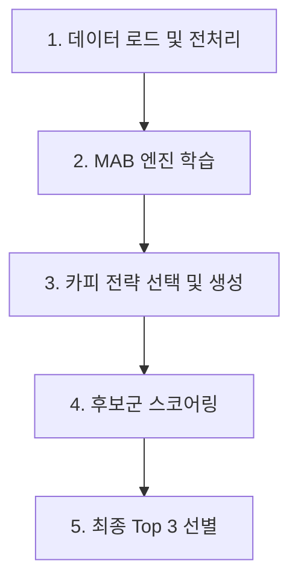

# MAB Copy System: 실행 순서 및 데이터 흐름 분석

이 문서는 `작동중코드` 디렉토리에 포함된 MAB(Multi-Armed Bandit) 기반 카피 최적화 시스템의 작동 방식과 데이터의 흐름을 설명합니다.

## 1. 전체 실행 순서 (High-Level Task Flow)

시스템의 메인 컨트롤러는 `mab_copy_system_v3.py`이며, 다음과 같은 순서로 작동합니다.

## 2. 모듈별 상세 역할 및 변수 흐름

### Step 1: 데이터 로드 및 MSS 계산
*   **파일**: `data_feedback_loop_v2.py`
    *   **코드**: `MSSDataIntegrator.process_all_data()`
    *   **입력**: `데이터 참조/dotori.xlsx` (사용자 과거 게시물 데이터)
    *   **로직**: 
        *   `본문조회수`와 `첫댓글조회수`를 파싱하여 숫자로 변환.
        *   **핵심 변수 설정**: `MSS` 점수 계산 -> `(첫댓글조회수^2) / 본문조회수`
    *   **출력**: MSS 점수가 포함된 `pandas.DataFrame`

### Step 2: MAB 엔진 학습 (Thompson Sampling)
*   **파일**: `mab_engine_v2.py`
    *   **코드**: `DynamicMAB.update()`
    *   **입력**: 위에서 계산된 `MSS` 데이터
    *   **로직**: 
        *   게시물의 성격(Arm)별로 MSS 점수를 누적 학습.
        *   **핵심 변수 설정**: `alpha`, `beta` (베타 분포 파라미터). 성공할수록 `alpha`가 커져 선택 확률이 높아짐.
    *   **특이사항**: `gamma`를 통한 시간 기반 감쇠(Decay) 적용 (최근 데이터에 더 높은 가중치).

### Step 3: 데이터 기반 프롬프트 생성
*   **파일**: `copy_generator_v2.py`
    *   **코드**: `DynamicCopyGenerator.generate_prompt()`
    *   **입력**: MAB가 선택한 전략, 과거 고성과 사례(`top_examples`)
    *   **로직**: 
        *   **핵심 변수 설정**: `effective_limit` (과거 대박 게시물 중 가장 효율적이었던 글자수).
        *   사용자의 말투(`;;`, `ㅋㅋ` 등)와 최적 글자수를 포함한 LLM 프롬프트 생성.

### Step 4: AI 스코어러 검증 (Sub-agent)
*   **파일**: `copy_scorer_v3.py`
    *   **코드**: `CopyScorer.generate_scoring_prompt()`
    *   **입력**: LLM이 생성한 카피 후보들
    *   **로직**: 
        *   생성된 카피가 과거 고성과 데이터의 '글자수'와 '구조'를 얼마나 잘 따랐는지 평가.
    *   **출력 (JSON)**: `predicted_mss_level`, `mss_score_estimate`, `final_weight` 등

### Step 5: 최종 선정
*   **파일**: `mab_copy_system_v3.py` (Main)
    *   **코드**: `scorer.select_top_3()`
    *   **로직**: `final_weight` 기준 내림차순 정렬 후 최상위 3개 출력.

## 3. 핵심 파일 요약

| 파일명 | 역할 | 주요 설정/로드 변수 |
| :--- | :--- | :--- |
| `mab_copy_system_v3.py` | **오케스트레이터** | 전체 파이프라인 조율, 최종 결과 출력 |
| `data_feedback_loop_v2.py` | **데이터 공급자** | `데이터 참조/dotori.xlsx` 로드, `MSS` 성과 지표 설정 |
| `mab_engine_v2.py` | **의사결정 엔진** | 전략별 `alpha`, `beta` 확률 모델 유지 |
| `copy_generator_v2.py` | **카피 생성기** | `effective_limit`(글자수 제한) 및 프롬프트 설정 |
| `copy_scorer_v3.py` | **검증기** | `predicted_mss` 기반 가중치(`final_weight`) 계산 |
| `benchmark_dotori.py` | **분석 도구** | 외부 데이터와의 성과 비교 및 톤 분석 (독립 실행 가능) |

---
> [!TIP]
> **데이터의 흐름 요약**:
> `데이터 참조/dotori.xlsx` (Raw) ➔ `MSS` (성과) ➔ `alpha/beta` (전략 확률) ➔ `effective_limit` (프롬프트 제약) ➔ `final_weight` (검증 점수) ➔ **최종 카피**
