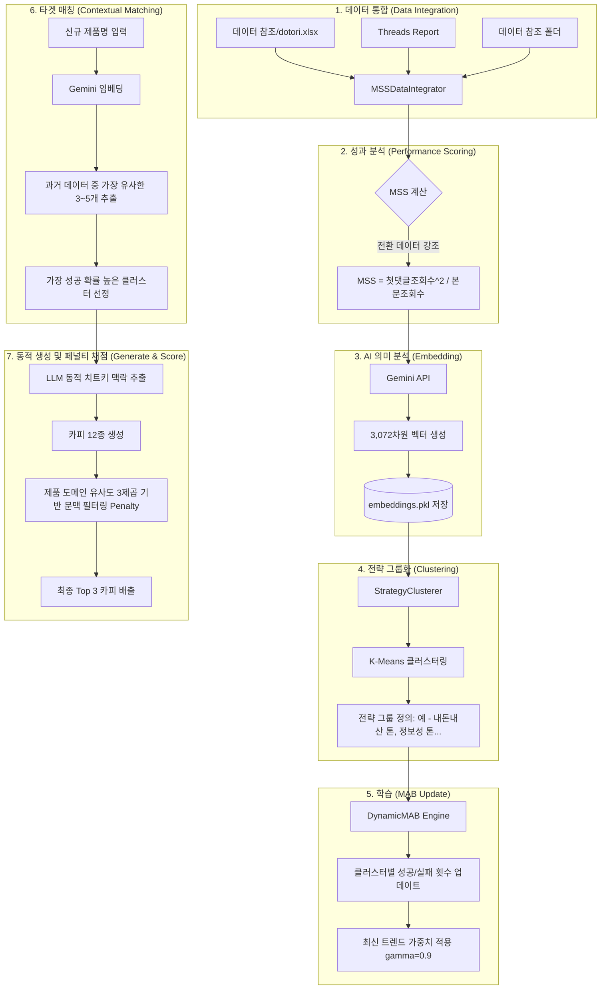

# MAB v3: 데이터 로딩부터 전략 선정까지의 로직 (Architecture Flow)

사용자님이 입력하신 제품으로 카피를 생성하기 전까지, 시스템 내부에서 일어나는 모든 과정을 순서대로 정리했습니다.

## 상세 로직 설명

### Stage 1: 데이터 통합 및 MSS 계산
*   흩어져 있는 여러 엑셀 파일을 하나로 합칩니다.
*   단순 조회수보다 **'첫 댓글 조회수(실질적인 전환/클릭)'**에 훨씬 큰 비중을 두는 공식을 사용합니다.
*   **공식**: `MSS = (첫댓글조회수^2) / 본문조회수`
    *   이 방식은 단순 노출(본문조회수) 대비 실제 행동(첫댓글조회수)이 일어난 비율을 제곱하여, '진짜 대박' 콘텐츠를 더 강력하게 선별합니다.

### Stage 2: 데이터 매핑 (Embedding & Storage)
*   **분석 완료 데이터**: 이미 분석된 2,300여 개의 게시물은 다시 AI에게 보내지 않습니다. `embeddings.pkl` 저장소에서 즉시 꺼내어 맵(좌표) 위에 배치합니다. (수동 데이터 추가 시에만 해당 부분만 분석)
*   **좌표 고정**: 모든 과거 데이터는 3,072차원의 고유한 수치로 고정되어 인벤토리에 **보관되었습니다**.

### Stage 3: 전략 클러스터링
*   좌표가 비슷한 글들끼리 모읍니다. (예: "이건 진짜 써봐야 함"과 "인생템 발견"은 같은 그룹으로 묶임)
*   이렇게 묶인 그룹들이 우리 시스템의 **'카드(Arms)'**가 됩니다.

### Stage 4: MAB 학습 및 망각 (Learning & Forgetting)
*   각 그룹(전략)이 과거에 얼마나 높은 MSS를 냈는지 점수를 합산합니다.
*   이때 `gamma` 값을 사용하여 **옛날 데이터보다 최근 데이터의 성과**를 더 중요하게 여깁니다. (최신 트렌드 반영)

### Stage 5: 최적 전략 선정 (Combination Logic)
*   **성과 우선 (Main)**: 과거에 MSS 점수가 높았던 '성공한 전략'들이 높은 기본 점수를 받습니다. (MAB 학습 결과)
*   **유사도 가중치 (Context)**: 방금 분석한 제품 좌표와 닮은 전략 그룹에 '보너스 점수'를 줍니다.
*   **최종 결정**: 이 두 가지(과거 성과 + 현재 제품과의 유사성)를 곱하여, **이번 제품을 팔기에 가장 승률이 높은 전략**을 최종 선택합니다.
    *   *즉, 단순히 닮은 전략을 고르는 게 아니라, 닮은 것들 중에서 가장 돈이 됐던(성과가 좋았던) 전략을 고르는 것입니다.*

---

### Stage 6: 동적 맥락 주입 (Dynamic Context)
*   LLM 카피를 작성하기 전, 1차적으로 선정된 유사 성공 사례들을 Gemini API로 분석하여 **"왜 터졌는지(상황/공간/인물 치트키)"**를 요약 추출합니다.
*   이 요약 맥락을 카피 생성 프롬프트에 동기화하여 키워드를 수동 하드코딩할 필요 없이 자동으로 완벽한 전략을 주입합니다.

### Stage 7: 로컬 하이브리드 채점 (Semantic Penalty)
*   **유사도 평가**: 12개의 후보가 생성되면, 과거 초고성과 글들의 중심점(Vector Centroid)과 얼마나 방향이 일치하는지 비교합니다.
*   **페널티 부과**: 외부 치트키를 억지로 우겨넣은 "아무말 대잔치"를 거르기 위해, 생성된 카피가 본래 **"타겟 제품의 속성(클러스터 중심점)"**과 얼마나 비슷한지 측정합니다. 이 수치를 **3제곱 연산**하여, 본질적인 문맥이 깨진 카피에는 무거운 가중 감점(Penalty)을 날립니다.
*   **최종 결과**: 결국 가장 높은 성과 구조를 가지면서도, 입력된 제품의 핵심 속성을 논리적으로 잘 지켜낸 Top 3 카피만이 유저에게 반환됩니다. (추가 API 사용량 0)
